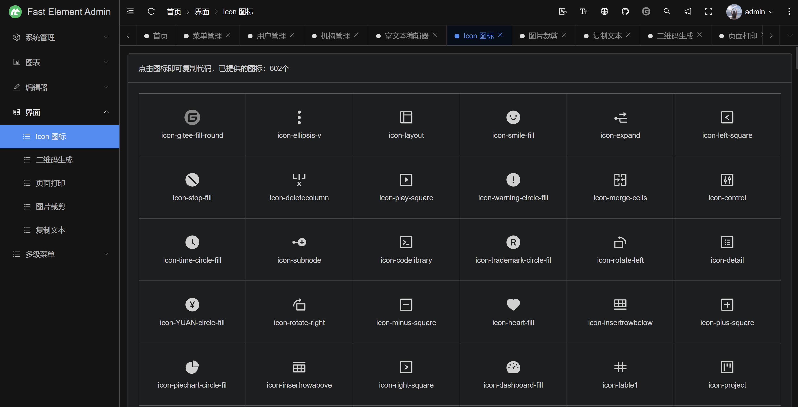
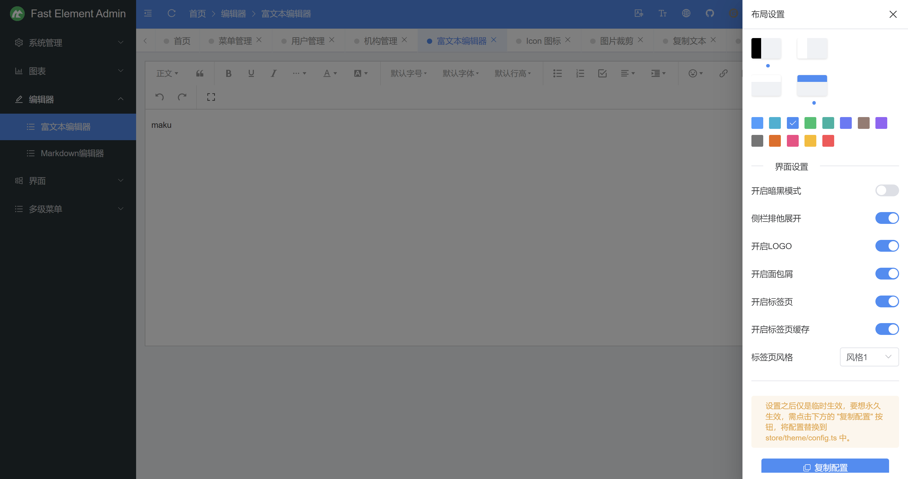

## 介绍
- maku-element-admin 是一个后台前端解决方案，它基于 Vue3、TypeScript、Element Plus、Pinia、Vite等实现。它使用了最新的前端技术栈，内置了 i18n 国际化解决方案，动态路由，暗黑模式，提供了常用的功能组件，它可以帮助你快速搭建企业级中后台产品原型。
- 演示环境：https://demo.maku.net/maku-element-admin
- 开发文档：https://maku.net/docs/maku-element-admin

## 安装
注意：需使用 nodejs 长期维护版本，如：[14.18+、16.x]，能保证项目的稳定运行。

```bash
# 克隆项目
git clone https://gitee.com/makunet/maku-element-admin.git

# 进入项目
cd maku-element-admin

# 安装依赖
npm install

# 运行项目
npm run dev

# 打包发布
npm run build
```

## 微信交流群
为了更好的交流，我们新提供了微信交流群，需扫描下面的二维码，关注公众号，回复【加群】，根据提示信息，作者会拉你进群的，感谢配合！


## 交流和反馈
- 官方社区：https://maku.net
- Github仓库：https://github.com/makunet/maku-element-admin
- Gitee仓库：https://gitee.com/makunet/maku-element-admin


## 支持
如果觉得框架还不错，或者已经在使用了，希望你可以去 [Github](https://github.com/makunet/maku-element-admin) 或 [Gitee](https://gitee.com/makunet/maku-element-admin) 帮作者点个 ⭐ Star，这将是对作者极大的鼓励与支持。

## 效果图





